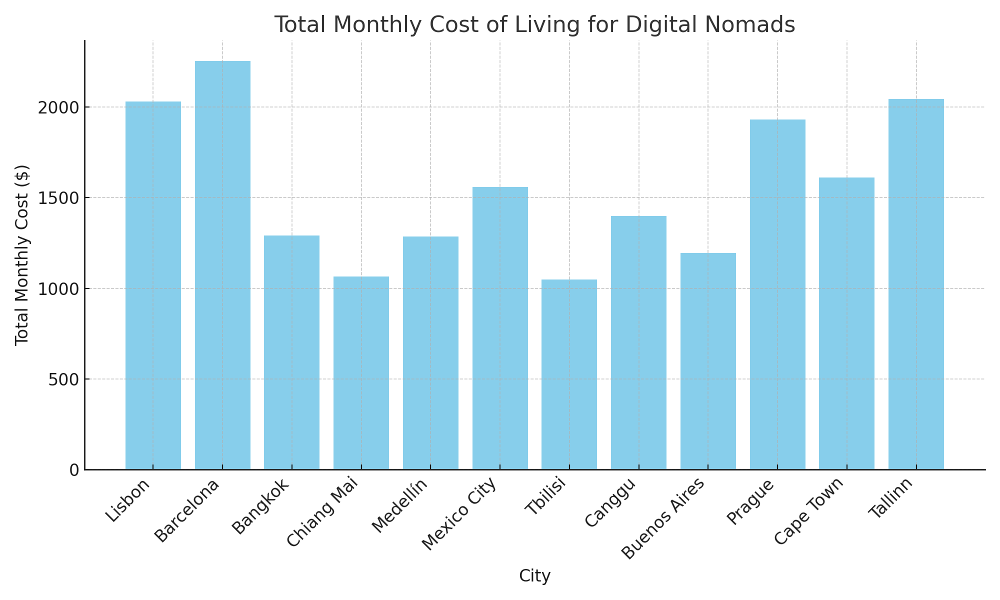

# Digital-Nomad
## 🌍 Digital Nomad Cost of Living Comparison

This project compares the monthly cost of living across 12 popular digital nomad cities around the world. It includes key expense categories such as rent, food, coworking, internet, transportation, and lifestyle spending. The goal is to help remote workers and location-independent professionals understand how far their budget will stretch in different parts of the world.

### 🔧 Tools Used
- **Excel** – Structured cost model and dataset
- **Python (Pandas + Matplotlib)** – Data processing and chart visualization

### 📊 Key Insights
- Cities like **Chiang Mai**, **Medellín**, and **Bangkok** offer strong affordability with total monthly costs below $1,300.
- Western European cities such as **Lisbon** and **Barcelona** have higher costs, driven mainly by rent and lifestyle expenses.
- A city’s coworking and internet costs are fairly consistent, but lifestyle spending varies widely depending on local culture and services.

### 📁 Files
- 📄 [`Digital_Nomad_Cost_Comparison.xlsx`](./Digital_Nomad_Cost_Comparison.xlsx) – Full cost breakdown per city
- 📊 [`Nomad_Cost_Comparison_Chart.png`](./Nomad_Cost_Comparison_Chart.png) – Bar chart visualizing total monthly cost by city
- 🐍 [`Digital_Nomad_Cost_Comparison.py`](./Digital_Nomad_Cost_Comparison.py) – Script to generate dataset and chart

### 📈 Chart Preview

This project is ideal for anyone planning long-term travel, freelance work abroad, or evaluating remote work destinations.
Notion: https://cultured-wanderer-6ce.notion.site/David-Gapinski-Data-Travel-Analytics-Portfolio-1fe223828d4880b4b4e3df0372f38645
